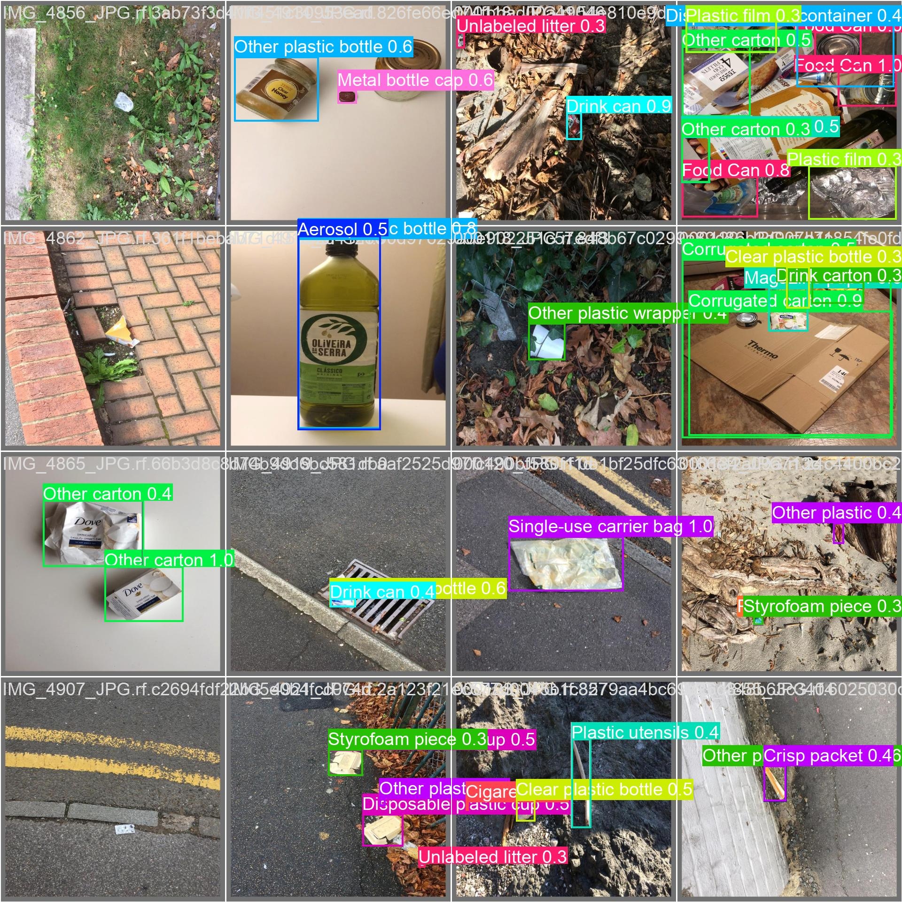

# Sustaina

## Brief Description

Sustaina is a real-time platform that leverages AI to crowdsource and visualize environmental issues. Through gamification, it fosters community engagement by rewarding users for reporting and resolving sustainability challenges, driving collective action for a greener future.

## Project Goal/Purpose

### **Together for Sustainability**

By spreading awareness and fostering collaboration, we aim to drive global participation in eco-friendly initiatives and creative problem-solving for a better tomorrow.

## Main Features

- **Interactive Map Interface** →
  - Displays garbage-prone hotspots based on user reports and AI analysis.
  - Provides real-time updates on cleaned areas and remaining waste density.
- **AI-Powered Trash Detection** →
  - Utilizes Computer Vision to identify and categorize different types of trash.
  - Estimates the density and distribution of waste in a given area.
- **AI-Based Clean Area Verification** →
  - Confirms whether an area has been properly cleaned using before-and-after image analysis.
  - Evaluates the effectiveness of waste collection by measuring density reduction.
- **Gamification System** →
  - Users earn XP, badges, and eco-coins for their cleanup efforts.
  - Potential integration with real-world incentives, such as discount coupons or rewards from eco-friendly brands.
- **Community Cleanup Events** →
  - Organizations can host large-scale cleanups, visible on the app’s map.
  - Users can join and track local cleanup initiatives, fostering community engagement.
- **Problem Identification & Reporting System** →
  - Report garbage-prone locations through GPS location tagging.
- **Proposal System for Innovative Green Solutions** →
  - Users can submit detailed proposals for sustainable solutions.

## Tech Stack

| Feature | Technology               |
| --- |--------------------------|
| Frontend | Kotlin (Jetpack Compose) |
| Backend | Firebase                 |
| Authentication | Firebase Auth            |
| AI Object Detection | Tensoflow and YOLO11     |
| Prototyping & UI Design | Figma                    |

---
### UP Cebu Hackathon 2025 - Sustainability Theme

## Interactive Map Interface
Our app features a dynamic and interactive map that provides users with real-time insights into waste management efforts in their area.

|               Interactive Map Hotspot                |            Interactive Map Clean-up Events            |
|:----------------------------------------------------:|:-----------------------------------------------------:|
|  |  |

- **Garbage-Prone Hotspots** – The map highlights areas with significant waste accumulation based on user reports and AI-driven analysis. This allows authorities, organizations, and volunteers to identify and address problem areas effectively.

- **Real-Time Cleanup Updates** – Users can track ongoing cleanup activities and see live updates on cleaned areas, including the estimated reduction in waste density.

- **Waste Density Visualization** – Th app add information of the volume and distribution of waste based on crowdsourcing, helping users and local governments prioritize cleanup efforts.

## AI Powered Trash Detection
Our AI-driven system utilizes Computer Vision and Machine Learning to automatically detect and classify various types of waste, improving sorting efficiency.

    
    

- **Smart Trash Recognition** – Using an image-based detection system, the AI classify trashes through different labels.

  List of Trash Labels

	- Aerosol
	- Aluminium blister pack
	- Aluminium foil
	- Battery
	- Broken glass
	- Carded blister pack
	- Cigarette
	- Clear plastic bottle
	- Corrugated carton
	- Crisp packet
	- Disposable food container
	- Disposable plastic cup
	- Drink can
	- Drink carton
	- Egg carton
	- Foam cup
	- Foam food container
	- Food Can
	- Food waste
	- Garbage bag
	- Glass bottle
	- Glass cup
	- Glass jar
	- Magazine paper
	- Meal carton
	- Metal bottle cap
	- Metal lid
	- Normal paper
	- Other carton
	- Other plastic
	- Other plastic bottle
	- Other plastic container
	- Other plastic cup
	- Other plastic wrapper
	- Paper bag
	- Paper cup
	- Paper straw
	- Pizza box
	- Plastic bottle cap
	- Plastic film
	- Plastic glooves
	- Plastic lid
	- Plastic straw
	- Plastic utensils
	- Polypropylene bag
	- Pop tab
	- Rope - strings
	- Scrap metal
	- Shoe
	- Single-use carrier bag
	- Six pack rings
	- Spread tub
	- Squeezable tube
	- Styrofoam piece
	- Tissues
	- Toilet tube
	- Tupperware
	- Unlabeled litter
	- Wrapping paper

- **Waste Density & Distribution Analysis** – Users can take a photo of waste, and the AI will instantly provide classification, ensuring proper waste segregation. Then the AI classifies the trashes based on its label.

## Smart Waste Segregation
To promote responsible waste disposal, the app provides a comprehensive AI-powered waste segregation system that guides users on how to properly sort and dispose of their trash.

- **AI Image-Based Classification**  – Users can upload or scan an image of waste items, and the app will automatically determine the correct category.

- **Step-by-Step Disposal Guide ** – Provides detailed disposal instructions tailored to local regulations, ensuring compliance with waste management policies.

## Gamification and Reward System
Encouraging environmental responsibility through an engaging reward system that motivates users to actively participate in cleanup efforts.

    

- **XP & Badge System** – Users earn experience points (XP) and unlock badges for activities such as correctly segregating waste, participating in cleanup drives, and reporting waste-prone areas.

- **Eco-Coins & Real-World Incentives** – Users can accumulate eco-coins that may be redeemable for discounts, vouchers, or rewards from eco-friendly brands and participating businesses or organizations.

## Community Clean-up Events
The app provides an organized platform for local and large-scale cleanup initiatives, making it easier for volunteers and environmental organizations to connect and collaborate.

    
    
    

- **Event Hosting & Registration** – Environmental groups, schools, and local governments can create and manage cleanup events, inviting users to participate through the app.

- **Live Event Tracking** – Users can view an interactive map of upcoming and ongoing cleanup drives, enabling them to join efforts in their local community.

- **Volunteer Progress Tracking** – Participants can log their contributions, track the amount of waste collected, and receive recognition for their efforts through rewards and badges.

## Problem Identification & Reporting System
Empowering communities with a user-driven reporting system to alert authorities and environmental groups about garbage accumulation issues.

- **GPS-Based Location Tagging** – Users can report garbage-prone areas by providing precise coordinates for cleanup efforts.

- **Description Submission** – Users can put descriptions of reported waste problems, allowing for better assessment and prioritization.

- **Direct Notifications to Cleanup Authorities **– The system sends real-time alerts to local waste management teams and environmental organizations, expediting cleanup responses.

## Proposal System for Innovative Green-Solutions
Encouraging users to contribute creative and sustainable solutions to environmental challenges by providing a dedicated proposal submission platform.

    

- **User-Submitted Green Initiatives **– Community can submit solution proposals for new environmental projects, upcycling solutions, or eco-friendly alternatives to common waste materials.

- **Community Voting & Feedback** – Users can vote and comment on submitted proposals, promoting collaboration and idea-sharing.

- **Support for Project Implementation** – The most promising solutions may be highlighted for funding, partnerships, or integration into real-world waste management programs.

## Team HackATon

### Team Leader:
- Carl Angelo Pepino

### Members:
- James Ewican
- Karl Phoenix Cornilla
- Rafael Mendoza
- Clark Modequillo
